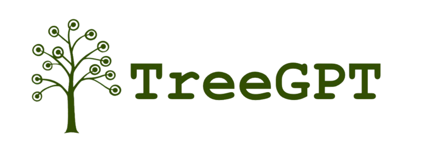

# TreeGPT

A Next.js application that visualizes chat conversations with GPT in a tree-like graph structure.

## Prerequisites

- Node.js (v18 or higher)
- npm or yarn
- OpenAI API key

## Setup

1. Clone the repository:

```bash
git clone https://github.com/yourusername/treegpt.git
cd treegpt
```

2. Install dependencies:

```bash
npm install
# or
yarn install
```

3. Create a `.env` file in the root directory:

```bash
OPENAI_API_KEY=your_api_key_here
```

Replace `your_api_key_here` with your actual OpenAI API key.

## Running the Application

1. Start the development server:

```bash
npm run dev
# or
yarn dev
```

2. Open your browser and navigate to:

```
http://localhost:3000
```

(or the URL shown in your terminal)

## What is TreeGPT?

TreeGPT ([treegpt.app](https://treegpt.app)) is a new chat interface built for speed and ease of use, based on modeling conversations with LLMs as trees (DAGs) instead of linearly.

### Problems TreeGPT Solves

1. **Tangential Conversations**

   - Traditional interfaces don't allow for branching conversations
   - TreeGPT enables chat tangents with easy context control

2. **Natural Language Search**

   - Search through chats using natural language descriptions
   - Uses metadata embeddings and RAG lookup for better search results

3. **Token Management**

   - Real-time token usage tracking and cost estimation
   - Control over output length and context window

4. **Model Selection**
   - Intelligent model routing based on heuristics and benchmarks
   - Support for multiple providers (OpenAI, Anthropic, Gemini, DeepSeek)

### Key Features

1. **Interactive Tree Visualization**

   - Mini-map showing the conversation tree
   - Visual "context lineage" highlighting
   - Node summaries and hover previews

2. **Vim-like Keybindings**

   - Toggle between "chatting" and "viewing" modes [`]
   - Tree navigation with [j] for up, [1-9] for edge selection
   - Root navigation [r]
   - Search functionality [/]
   - Node editing [e]
   - Node deletion [dd]

3. **Advanced Architecture**

   - Tree-based data modeling for efficient search and caching
   - LiteLLM integration for API and context management
   - Support for personal API keys or subscription-based usage

4. **Multi-Model Support**
   - Connect to various LLM providers using your own API keys
   - Intelligent model routing between providers
   - Comparative testing of different models

## Tech Stack

- Next.js 14
- React
- React Flow
- Tailwind CSS
- OpenAI API
- LiteLLM
- AWS Infrastructure
